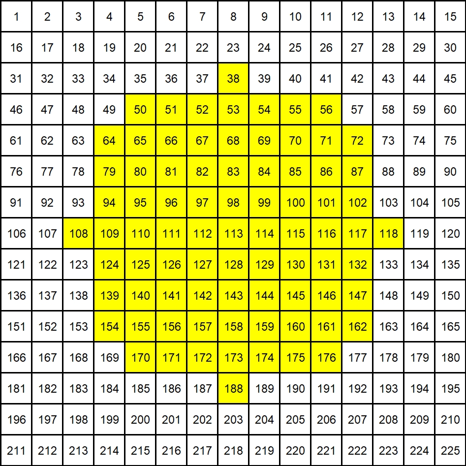

## PSF Fitting and 3D Localization

In the final step of **3D localization**, the pre-computed `./pth/psffit_matrix.mat` file will be used.

### PSF Parameters

The default PSF parameters are as follows:

- **Number of views**: A total of 15 × 15 views, but only 81 views within the central circular region (r = 5) are used
- **Experimental settings**:
  - Magnification: 10×
  - Excitation wavelength: 525 nm
  - Axial range: –150 μm to +150 μm
  - z-step size: 3 μm
  - Numerical aperture (NA): 0.4
  - Objective focal length (fml): 1251 μm
  - Tube lens focal length (ftl): 180 mm

### Structure of `psffit_matrix`

The matrix stored in `psffit_matrix.mat` contains the following columns:

| Column | Description                                                  |
| ------ | ------------------------------------------------------------ |
| 1      | Source view ID                                               |
| 2      | Target view ID                                               |
| 3      | Linear coefficient of lateral shift in the x direction ($α_x$, unit: shift/z) |
| 4      | Intercept of x-direction shift                               |
| 5      | Linear coefficient of lateral shift in the y direction ($α_y$, unit: shift/z) |
| 6      | Intercept of y-direction shift                               |

### IMPORTANT NOTE!!!

Since the PSF obtained under your experimental conditions may differ from ours, **before running `main_pipeline.py` on your dataset**, please first execute `get_PSFfit_matrix.py` in this directory to generate a `psffit_matrix.mat` that is compatible with your data.

