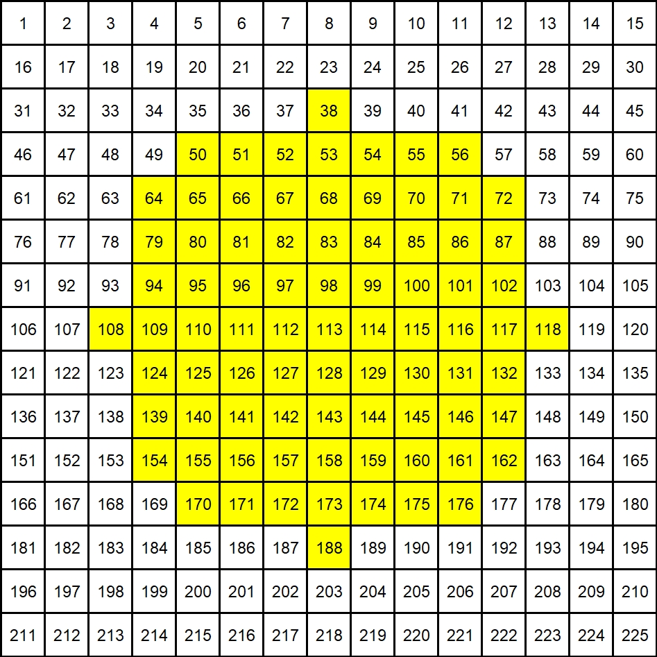
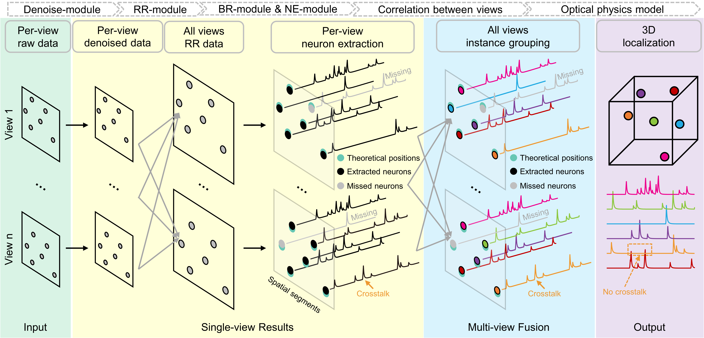

Welcome to **DeepWonder3D**, a comprehensive computational framework designed for the rapid and robust extraction of neuronal information from 3D calcium imaging datasets. This pipeline orchestrates the transition from raw, noisy volumetric data to precise 3D spatial localization and high-fidelity temporal traces, facilitating the analysis of large-scale neuronal dynamics.

## I. System Preparation and Requirements

Before executing the pipelines, ensure your local directory is structured as follows to allow for seamless data ingestion and model initialization:

### 1. Pre-trained weights and calibration (`/pth`)

The `/pth` directory must contain the necessary network weights and the optical calibration matrix:

- **Model Weights**: `DENO_pth`, `RMBG_pth`, `SEG_pth`, and `SR_pth`.
- **Calibration**: `psffit_matrix.mat` (Essential for 3D localization).

### 2. Input datasets (`/datasets`)

Raw imaging data should be organized within the `datasets/` directory. For standard testing, place your volumetric files in `datasets/test/`.

### 3. PSF fitting and 3D localization

In the final step of **3D localization**, the pre-computed `./pth/psffit_matrix.mat` file will be used.

#### PSF parameters

The default PSF parameters are as follows:

- **Number of views**: A total of 15 × 15 views, but only 81 views within the central circular region ($r = 5$) are used.
- **Experimental settings**:
  - Magnification: 10×
  - Excitation wavelength: 525 nm
  - Axial range: –150 μm to +150 μm
  - z-step size: 3 μm
  - Numerical aperture (NA): 0.4
  - Objective focal length (fml): 1251 μm
  - Tube lens focal length (ftl): 180 mm

#### Structure of `psffit_matrix`

The matrix stored in `psffit_matrix.mat` contains the following columns:

| **Column** | **Description**                                              |
| ---------- | ------------------------------------------------------------ |
| 1          | Source view ID                                               |
| 2          | Target view ID                                               |
| 3          | Linear coefficient of lateral shift in the x direction ($\alpha_x$, unit: shift/z) |
| 4          | Intercept of x-direction shift                               |
| 5          | Linear coefficient of lateral shift in the y direction ($\alpha_y$, unit: shift/z) |
| 6          | Intercept of y-direction shift                               |

> **⚠️ IMPORTANT NOTE!!!**
>
> Since the PSF obtained under your experimental conditions may differ from ours, **before running `main_pipeline.py` on your dataset**, please first execute `get_PSFfit_matrix.py` in this directory to generate a `psffit_matrix.mat` that is compatible with your data.

## II. Parameter Configuration

The pipeline's behavior is governed by several key parameters defined in the `__main__` block of the execution scripts:

| **Parameter**       | **Meaning**                                                  | **Note**                                                     |
| ------------------- | ------------------------------------------------------------ | ------------------------------------------------------------ |
| `now_pixel_size`    | The spatial resolution of input raw data (μm).               | Derived from microscope metadata.                            |
| `target_pixel_size` | The desired spatial resolution after DW3D enhancement (μm).  | This repository provides pre-trained model weights (`.pth`) for both 1 μm and 2 μm resolutions for user selection. |
| `t_resolution`      | The temporal resolution (i.e., frame rate) of input raw data (Hz). | Derived from microscope metadata.                            |
| `GPU_index`         | Specifies which GPU device to use.                           | e.g., `'0'` or `'0,1'`.                                      |
| `type`              | Selector string for active pipeline modules.                 | e.g., `'deno_sr_rmbg_seg_mn_vm'`.                            |

While the key parameters above require manual definition in `main_pipeline_2d.py` or `main_pipeline_3d.py`, other auxiliary and fine-grained configurations are predefined in `para_dict.py`. Advanced users may modify that file to adjust internal model hyperparameters; however, please note that suboptimal or excessively aggressive hyperparameter tuning may adversely impact DW3D's performance. Should you choose to explore these advanced configurations, please refer to the comprehensive comments within the source code for more guidance.

## III. Modular Pipeline Architecture

DeepWonder3D utilizes a modular sequence of processing steps to ensure robustness, fidelity, and computational efficiency. Users can configure the execution via the `type` parameter to include specific steps:

- **DENO (Denoising)**: Enhances the signal-to-noise ratio (SNR) of raw data.
- **TR (Temporal Resolution)**: Performs temporal resampling to adjust the frame rate to the required resolution.
- **SR (Spatial Resolution)**: Applies spatial resampling to achieve target spatial resolution.
- **RMBG (Remove Background)**: Removes background fluorescence to isolate calcium transients.
- **SEG (Segmentation)**: Generates short-term spatial semantic masks of neuron candidates.
- **MN (Merge Neurons)**: Finalizes instance segmentation (i.e., merges neuron instances via spatiotemporal connectivity analysis and extracts their corresponding temporal traces).
- **VM (View Merging)**: (**3D Only**) Executes multi-view fusion and 3D localization utilizing Point Spread Function (PSF).

| **Code implementation (step)** | **Manuscript reference (module)**          |
| ------------------------------ | ------------------------------------------ |
| **DENO**                       | Denoising Module                           |
| **TR & SR**                    | Resolution Registration Module (RR-module) |
| **RMBG**                       | Background Removal Module (BR-module)      |
| **SEG & MN**                   | Neuronal Extraction Module (NE-module)     |
| **VM**                         | Multi-view Fusion Module (MVF-module)      |

## IV. Pipeline Execution and Output

### 1. 2D vs. 3D processing

- **`main_pipeline_2d.py`**: Optimized for single-plane or maximum intensity projection (MIP) data where axial depth is not required.
- **`main_pipeline_3d.py`**: Integrates **View Merging (VM)** to achieve multi-view fusion and 3D localization of neurons.

### 2. Hierarchical result structure

Upon completion, the `output_dir` will contain a structured sequence of results across seven distinct steps:

- **`STEP_1_DENO`**: Denoised data with enhanced SNR.
- **`STEP_2_TR`**: Data resampled to the target temporal resolution.
- **`STEP_3_SR`**: Data resampled to the target spatial resolution.
- **`STEP_4_RMBG`**: Background-subtracted data isolating neuronal signals.
- **`STEP_5_SEG`**: Short-term semantic masks identifying neuronal candidates.
- **`STEP_6_MN`**: Merged neuron instances and their extracted temporal traces.
- **`STEP_7_VM`**: (**3D Only**) Final 3D localization and merged temporal traces.
- **`times`**: Total running time of each processing step.

To provide a more intuitive understanding of the workflow, we use demo data to provide a step-by-step visual tutorial of DeepWonder3D. The following images demonstrate the  outputs from the early stages of the DeepWonder3D pipeline for data preprocessing (i.e., denoising module, RR-module, and BR-module).

Below are the expected outputs from the late stages of the DeepWonder3D pipeline (i.e., NE-module and MVF-module).

## V. Model Training (`main_train.py`)

While pre-trained models are readily available in the `/pth` directory, `main_train.py` provides the flexibility to train or fine-tune the `DENO`, `SR`, `RMBG`, and `SEG` networks for specialized biological samples or specific microscope configurations.

Configure the `main_train_pipeline` in the `__main__` block of `main_train.py`:

- **Target selection**: Set `type='sr'`, `'rmbg'`, or `'seg'` to choose the model for training.
- **Data input**: Ensure `input_path` and `input_folder` point to your annotated training pairs.
- **Sequential training**: You can combine keywords (e.g., `type='sr_rmbg'`) to train multiple architectures consecutively.

