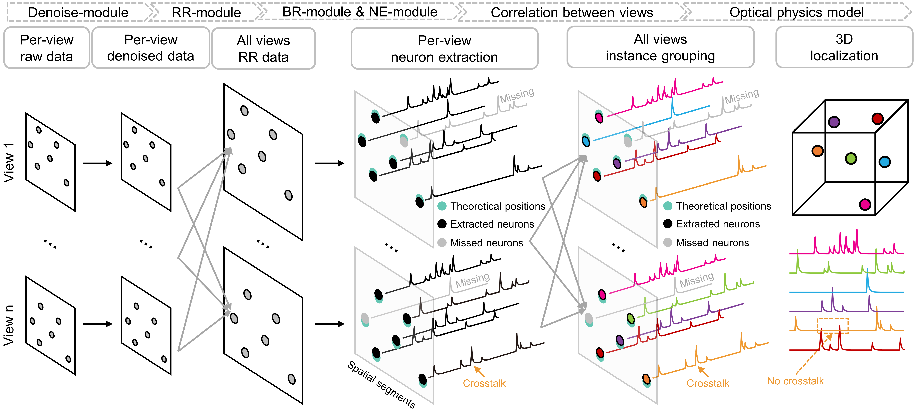
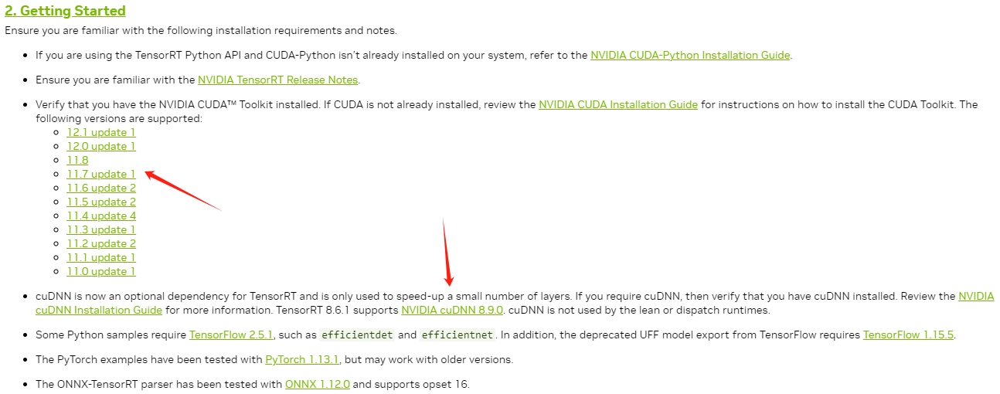

# Deepwonder3D：**Rapid** robust high-fidelity 3D neuronal extraction from multi-view projections


## About DeepWonder3D

**DeepWonder3D** is a general pipeline designed for rapid and robust neuronal extraction from 3D calcium imaging datasets. Unlike conventional methods that operate voxel by voxel, DeepWonder3D processes multi-view projections—either digitally or optically generated via specific point spread functions (PSFs)—making it broadly compatible with diverse imaging techniques, including point-scanning microscopy, light-field microscopy, and synthetic aperture two-photon microscopy.

The pipeline integrates **denoising**, **resolution registration**, **background removal**, **neuronal extraction**, and **multi-view fusion** into a unified workflow optimized for large-scale high-resolution datasets contaminated by noise and scattering. DeepWonder3D enables accurate localization of neurons in 3D space and extracts high-fidelity temporal calcium traces, all with notably improved processing efficiency. Its effectiveness has been validated on both simulated data and real recordings from a hybrid two-photon/light-field imaging system.



## Our Environment

- Ubuntu 20.04
- Python 3.8
- Pytorch 2.0.1
- TensorRT 8.6.1
- CUDA 11.8
- cuDNN 8.9.0

## Installation

1. Install [Anaconda](https://www.anaconda.com/), [CUDA 11.8](https://developer.nvidia.com/cuda-toolkit-archive), and [cuDNN 8.9.0](https://developer.nvidia.com/rdp/cudnn-archive)

2. Create a virtual environment and install PyTorch 2.0.1.

   ```python
   conda create -n dw3d python=3.8
   conda activate dw3d
   conda install pytorch==2.0.1 torchvision==0.15.2 torchaudio==2.0.2 pytorch-cuda=11.8 -c pytorch -c nvidia
   ```

3. (recommended, but optional) Login / Register a nvidia account and download the TAR package for TensorRT [here](https://developer.nvidia.com/nvidia-tensorrt-8x-download).

4. (recommended, but optional) Install the TensorRT according to the [official installation guide](https://docs.nvidia.com/deeplearning/tensorrt/archives/tensorrt-861/install-guide/index.html#installing-tar).

5. Download the source code and use DeepWonder3D

**[Important Notes !!!]** 

1. The following commands can be used to verify that your installation works well.

   ```python
   python3
   >>> import tensorrt
   >>> print(tensorrt.__version__)
   >>> assert tensorrt.Builder(tensorrt.Logger())
   ```

2. If the above test fails, one of the possible reasons is that the global **PATH is not set** correctly. Suppose your TensorRT is in the folder `/data/user/lib64/TensorRT-8.6.1.6` , then add the following to `.bashrc` or `.profile`

   ```python
   # >>> tensorRT initialize >>>
   export CUDA_MODULE_LOADING=LAZY
   export LD_LIBRARY_PATH="/data/user/lib64/TensorRT-8.6.1.6/lib:$LD_LIBRARY_PATH"
   export PATH="/data/user/lib64/TensorRT-8.6.1.6/bin:$PATH"
   # <<< tensorRT initialize <<<
   ```

   If the TensorRT folder moved to another place, don't forget to change the path correspondingly.

3. Installing pytorch requires aligning CUDA version + Python version, while installing TensorRT requires aligning CUDA version + cuDNN version + Python version. For example, the following screenshot of [Installation Guide for TensorRT 8.6.1](https://docs.nvidia.com/deeplearning/tensorrt/archives/tensorrt-861/install-guide/index.html#gettingstarted) explicitly tells the CUDA versions and cuDNN versions that TensorRT 8.6.1 is compatible with.

   

   The combination of versions we offered here will works well. But if you want to use different versions of Python, CUDA, cuDNN, Pytorch, and TensorRT, **make sure that their versions are compatible with each other**.

4. In fact, our method is also compatible with Windows system. We have tested it on Win10 and it works well. The main difference during environment installation is

   - Download the ZIP package of TensorRT instead of TAR package

   - Setting the environment variables in a different way

     > To add/change an *environment variable* permanently in Windows (so that it is available to ALL the Windows' processes/users and stayed across boots):
     >
     > 1. Launch "Control Panel"
     > 2. "System"
     > 3. "Advanced system settings"
     > 4. Switch to "Advanced" tab
     > 5. "Environment variables"
     > 6. Choose "System Variables" (for all users)
     > 7. To *add* a new environment variable:
     >    1. Choose "New"
     >    2. Enter the variable "Name" and "Value". Instead of typing the "value" and making typo error, I suggest that you use "Browse Directory..." or "Browse File..." button to retrieve the desired directory or file.
     > 8. To *change* an existing environment variable:
     >    1. Choose "Edit"
     >    2. Enter the new "Value". Instead of typing the "value" and making typo error, I suggest that you use "Browse Directory..." or "Browse File..." button to retrieve the desired directory or file.
     >
     > You need to **RE-START** CMD for the new setting to take effect!
     >
     > (cited from [here](https://www3.ntu.edu.sg/home/ehchua/programming/howto/Environment_Variables.html))
